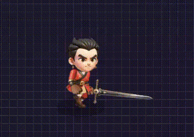
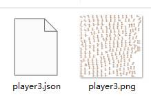
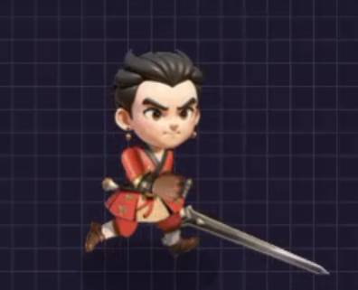
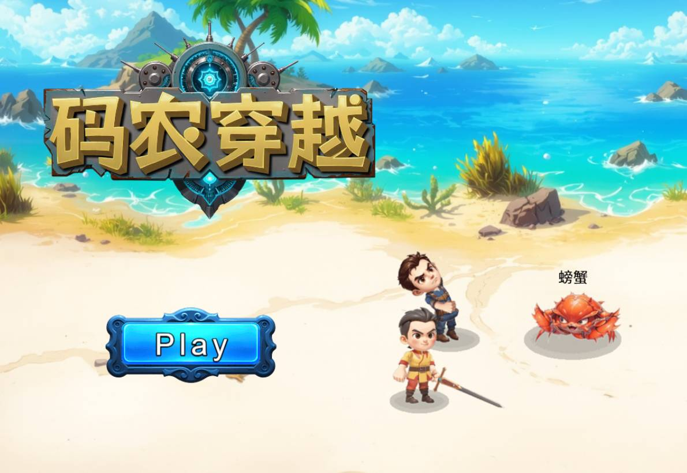
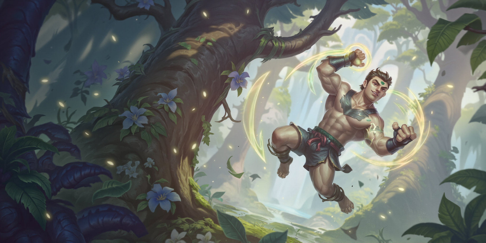
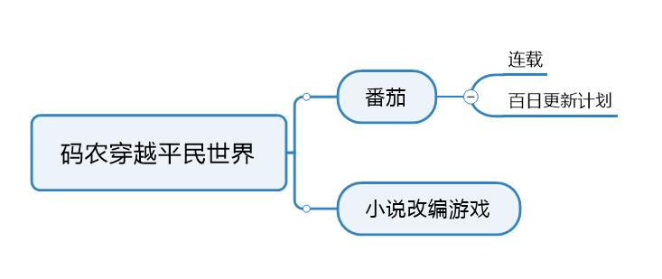
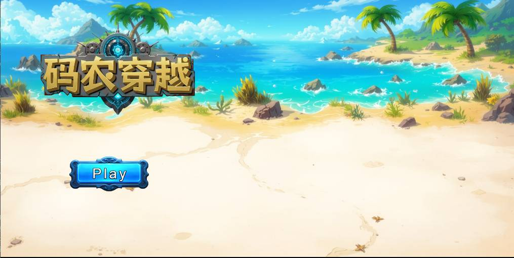
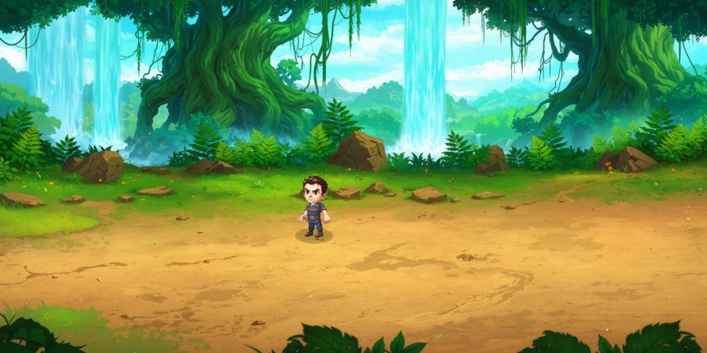

# 项目名 DeGameTropicalIsLand
游戏开发资源去中心化交易平台 v0.1 版本

# 初步想法
建立一个游戏开发资源交易平台，让游戏开发者或团队可以上架自己的创意想法，游戏资源,如角色动画，UI，场景，图标，demo展示等。用户人群浏览上架的游戏资源，并可用积分投票转换成<B>「观众期待值」</B>，如果游戏最终上线，用户人群凭借早期投票凭证可以获得积分奖励和游戏优惠，并获得长期盈利收益。

# AI技术的发展
* 人工智能在游戏开发中的应用越来越广泛，例如AI可以生成游戏角色、场景和动画等。
* AI技术可以帮助开发者快速原型制作，提高开发效率。
* 目前最关键是AI已经解决了 <B>图片一致性问题</B> ,可以生成流畅的连续帧动画。

# 模块列表
* 作者模块: 上架创意想法，游戏资源,如动画，角色，地图，demo展示。
* 用户模块: 浏览、投票、购买、出售游戏资源。
* 积分模块: 积分作为结算的依据，然后根据盈利比列进行发放。作者可发行自己的积分币，用来给读者粉丝福利换取<B>「观众期待值」</B>。

# 盈利模式
* 用户可以将资产在Bucket、Scallop、Navi等 存入/取出/借贷等行为，获得DGTI积分。
* 用户浏览上架的游戏资源，并可用积分投票换成<B>「观众期待值」</B>，如果游戏最终上线，买家可以获得积分奖励和游戏优惠。

# 角色设定
* 独立作者
* 团队组织
* 用户
* 管理员

# 游戏资源参考

## 创作者可以提交自己的demo展示

## 创作者提交角色动画创意的资源方式

## 效果图

## 创作者可以提交自己的封面

## 上架一些自己生成后觉得不错但自己用不到的图

## 提交一个自己的创意想法

# 扩展
* 后期用户可以上架 unity的package资源 等

 
 

# Todo List

## 1. 立项

- [x] 完成项目一的初步规划 v0.1
  - [X] 定义项目目标
  - [X] 制定时间表
  - [X] 分配任务
- 基础框架

