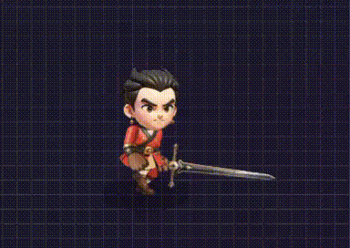
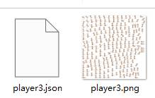
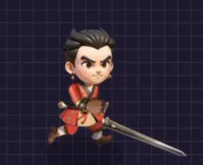
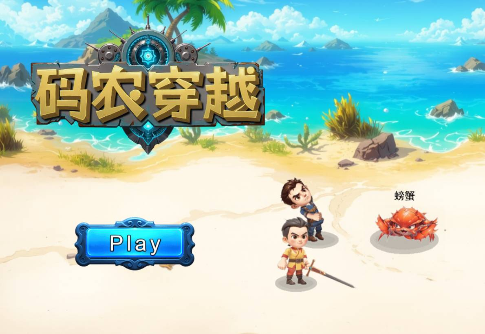
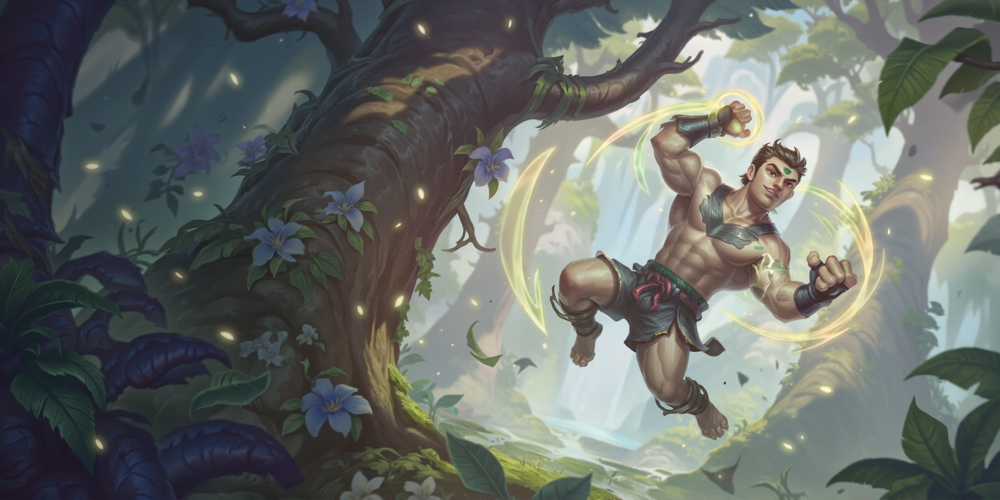
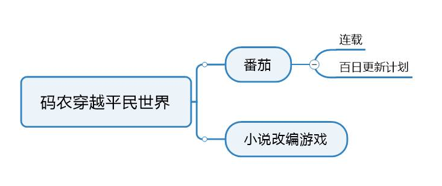
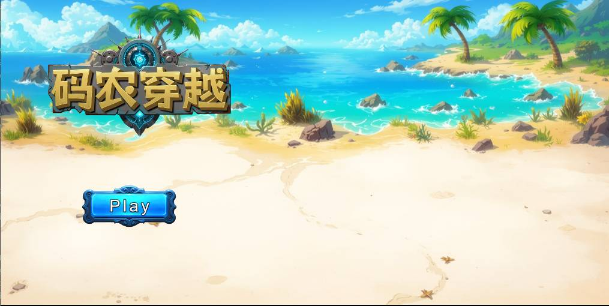
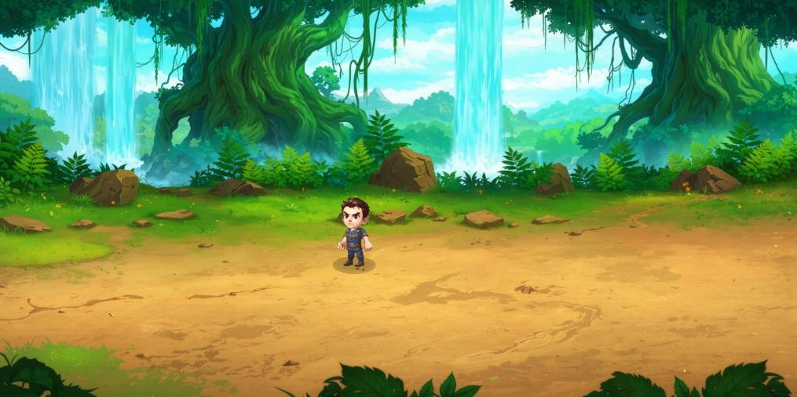
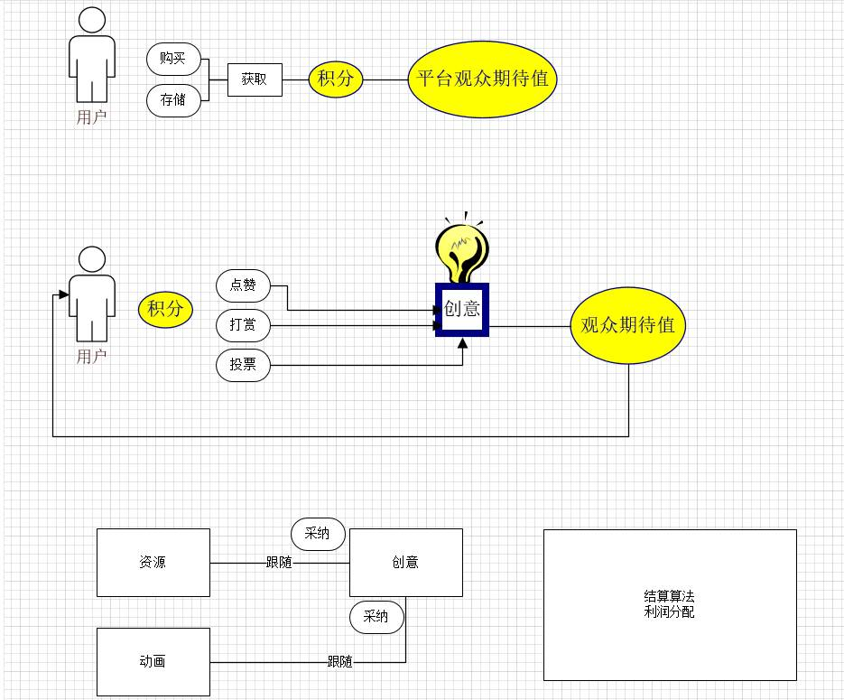

# 项目名 创意空间  v0.9.2 
* SparkSpace
* 创意去中心化交易平台 
* 以终为始 -- 通过发布创意帮助创意者寻找真正需求。

* 建立一个创意发布交易平台，让应用开发者、游戏开发者、团队可以上架自己的创意想法、游戏资源。
* 创意举例:如一个想法、角色动画、UI、场景、图标、demo展示等。
* 用户人群浏览上架的各种想法和资源，并可用自己的积分投票这些创意并转换成<B>「观众期待值」</B>。
* 如果想法、应用、游戏最终上线，用户人群凭借早期投票凭证可以获得积分奖励和优惠，并有机会获得长期盈利收益。
* 以前的开发流程是先立项、计划、开发，再上架，现在反过来，先上架创意想法、找到需求、然后开发、接着迭代、最后盈利。

# 目前AI技术的发展
* 人工智能在应用、游戏开发中的应用越来越广泛，例如AI可以生成游戏角色、场景和动画等。
* AI vibe coding 技术可以帮助开发者快速原型和成品的制作，提高开发效率。
* 目前最关键是AI已经解决了游戏精灵 <B>图片一致性问题</B> ,可以生成流畅的连续帧动画。
* 关注AI赛道全流程的创意想法。

# 模块列表
* 创意者模块: 上架创意想法，游戏资源，如动画，角色，地图，demo展示等。
* 用户模块: 浏览、投票、购买、出售游戏资源。
* 积分模块: 积分作为结算的依据，然后根据盈利比列进行发放。作者可发行自己的积分币，用来给读者粉丝福利换取<B>「观众期待值」</B>。

# 盈利模式
* 用户可以将资产在Bucket、Scallop、Navi等 存入/取出/借贷等行为，获得<B> CYKJ </B> 积分。
* 用户浏览上架的游戏资源，并可用积分投票换成<B>「观众期待值」</B>，如果游戏最终上线运营且盈利，用户可以获得相应的积分奖励和游戏优惠。
* 低风险投资，资金没有存入任何创意方账户，所以创意方不存在跑路一说。

# 角色设定
* 创意者：应用开发者、独立游戏开发者、小说作者、漫画家等创意人士。
* 团队组织：公司、团队、小组
* 用户：投资人、游客、爱好者、吃瓜群众、有想法的玩家、开发者等。
* 管理员：审核不良信息

# 游戏资源参考

## 创作者可以提交自己的demo展示

## 创作者提交角色动画创意的资源方式

## 效果图

## 创作者可以提交自己的封面

## 上架一些自己生成后觉得不错但自己用不到的图

## 提交一个自己的创意想法

# 扩展
* 后期用户可以上架 unity的package资源 等

 
 

# Todo List

## 1. 立项

- [x] 完成项目一的初步规划 v0.3
  - [X] 定义项目目标
  - [X] 制定时间表 和里程碑
  - [X] 分配任务
- 基础框架

## 阶段二：核心功能开发
   ### 基础核心点 
   - 创意 - [创意对象实例](./docs/cyobject.md)- 创意盈利 - 观众期待值 - 数字|现实世界对接
   - 积分 - 点赞/打赏
   - 观众期待值
0. 积分系统设计 (购买积分、兑换资源)
1. 创意创作系统
   - 创作者注册登录
   - 创意提交
   - 投票创意

2. 游戏资源分享平台
   - 资源上传接口开发
   - 积分交易流程设计
   - 智能合约基础框架
3. 盈利分配算法 结算流程 
   - 用户返利 = 创意盈利 * 观众期待值 / 创意总期待值
   - 创意盈利 = 平台盈利 * 创意总期待值 / 平台总创意期待值
   - 盈利分配: 10%平台 20%投资人 70%平台盈利金库
   - 平台盈利 = 平台手续费 + 广告费

# 积分机制

 
 
 

[参考资料](./docs/参考资料.md)
