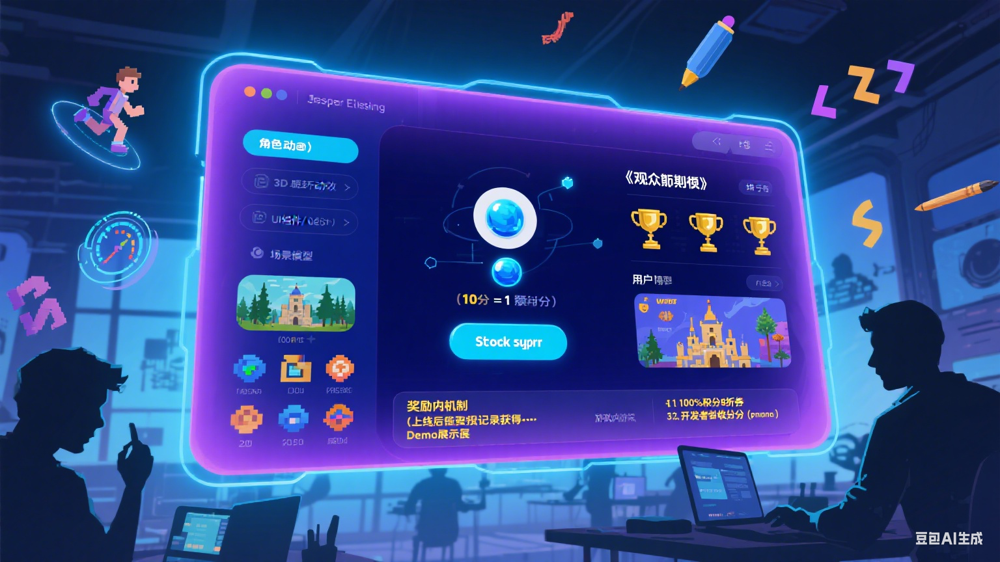

# 项目名 创意心集(暂定)
备用方案：创意灵感库、创意灵感交易平台、创意灵感社区、创意灵感商店
创意空间 创意畅想 创意梦想 创意乐园 创意思维 未来之梦 创意大拿
造梦空间

创意去中心化交易平台 v0.21 版本

# 初步想法
<br>
建立一个创意发布交易平台，让应用开发者、游戏开发者、团队可以上架自己的创意想法、游戏资源。如一个想法、角色动画、UI、场景、图标、demo展示等。用户人群浏览上架的各种想法和资源，并可用积分投票转换成<B>「观众期待值」</B>，如果想法、应用、游戏最终上线，用户人群凭借早期投票凭证可以获得积分奖励和优惠，并有机会获得长期盈利收益。

# 目前AI技术的发展
* 人工智能在游戏开发中的应用越来越广泛，例如AI可以生成游戏角色、场景和动画等。
* AI vibe coding 技术可以帮助开发者快速原型和成品的制作，提高开发效率。
* 目前最关键是AI已经解决了游戏精灵 <B>图片一致性问题</B> ,可以生成流畅的连续帧动画。

# 模块列表
* 作者模块: 上架创意想法，游戏资源，如动画，角色，地图，demo展示。
* 用户模块: 浏览、投票、购买、出售游戏资源。
* 积分模块: 积分作为结算的依据，然后根据盈利比列进行发放。作者可发行自己的积分币，用来给读者粉丝福利换取<B>「观众期待值」</B>。

# 盈利模式
* 用户可以将资产在Bucket、Scallop、Navi等 存入/取出/借贷等行为，获得<B> DGTI </B> 积分。
* 用户浏览上架的游戏资源，并可用积分投票换成<B>「观众期待值」</B>，如果游戏最终上线运营且盈利，用户可以获得相应的积分奖励和游戏优惠。
* 低风险投资，资金没有存入任何创意方账户，所以创意方不存在跑路一说。

# 角色设定
* 创意者：应用开发者、独立游戏开发者、小说作者、漫画家等创意人士。
* 团队组织：公司、团队、小组
* 用户：投资人、游客、爱好者、吃瓜群众
* 管理员：审核不良信息

# 游戏资源参考

## 创作者可以提交自己的demo展示


## 创作者提交角色动画创意的资源方式


## 效果图


## 创作者可以提交自己的封面


## 上架一些自己生成后觉得不错但自己用不到的图


## 提交一个自己的创意想法


# 扩展
* 后期用户可以上架 unity的package资源 等


<br>
<br>

# Todo List

## 1. 立项

- [x] 完成项目一的初步规划 v0.2
  - [X] 定义项目目标
  - [] 制定时间表 和里程碑
  - [] 分配任务
- 基础框架


参考文献
```
https://github.com/MystenLabs/seal
https://github.com/Euraxluo/seal-101
https://learnblockchain.cn/article/17062
https://github.com/dwallet-labs/ika
```
